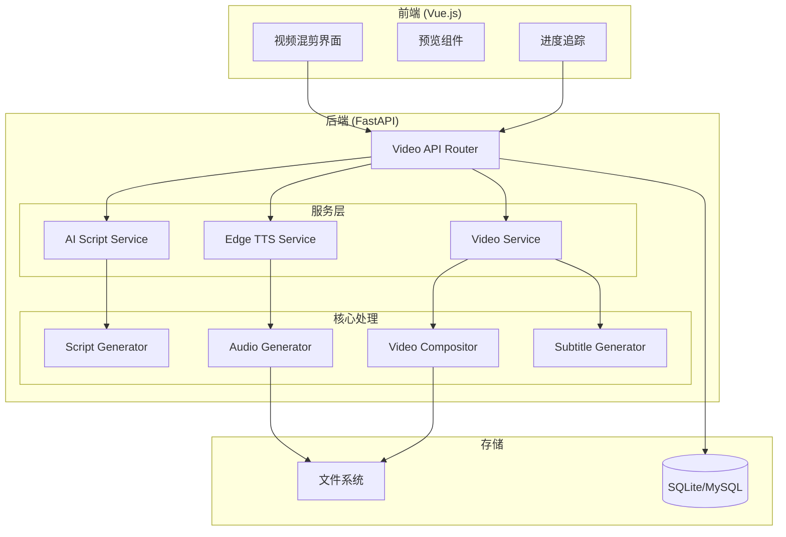
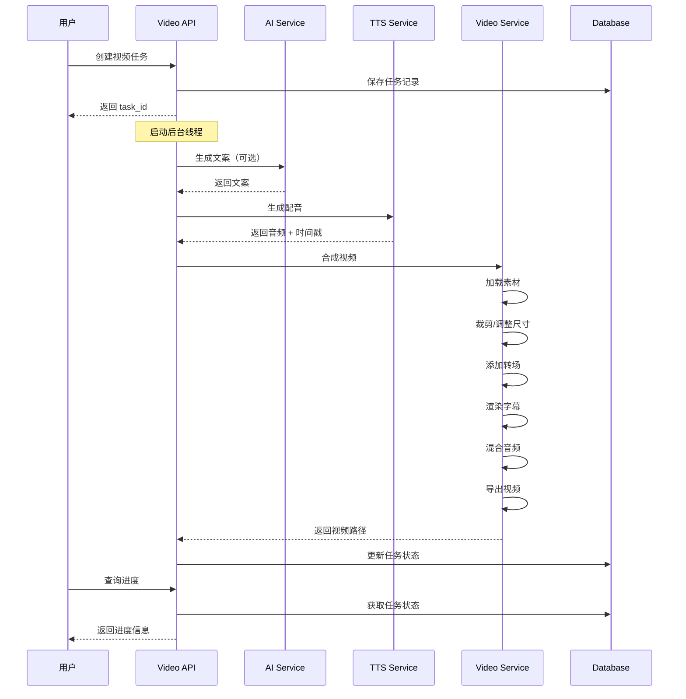

                                                                                        # Design Document: 视频混剪系统

## Overview

视频混剪系统是一个基于 Python FastAPI 后端和 Vue.js 前端的自动化视频创作平台。系统使用 MoviePy 作为核心视频处理引擎，集成 AI 文案生成（多 LLM 支持）、Edge TTS 语音合成、多视频高光混剪和自动字幕生成功能。

系统采用异步任务处理架构，支持后台线程处理视频生成任务，提供实时进度追踪和任务状态管理。

## Architecture



### 处理流程



## Components and Interfaces

### 1. Video Configuration Manager

负责管理视频配置选项和预设。

```python
# 视频分辨率配置
VIDEO_RESOLUTIONS = {
    "480p": {"width": 854, "height": 480},
    "720p": {"width": 1280, "height": 720},
    "1080p": {"width": 1920, "height": 1080},
    "2k": {"width": 2560, "height": 1440},
    "4k": {"width": 3840, "height": 2160},
}

# 视频布局（宽高比）
VIDEO_LAYOUTS = {
    "9:16": {"name": "竖屏短视频", "ratio": (9, 16)},
    "3:4": {"name": "小红书", "ratio": (3, 4)},
    "1:1": {"name": "方形", "ratio": (1, 1)},
    "4:3": {"name": "传统", "ratio": (4, 3)},
    "16:9": {"name": "横屏标准", "ratio": (16, 9)},
    "21:9": {"name": "宽银幕", "ratio": (21, 9)},
}

# 帧率选项
FRAME_RATES = [24, 25, 30, 50, 60]

# 平台预设
PLATFORM_PRESETS = {
    "douyin": {"resolution": "1080p", "layout": "9:16", "fps": 30},
    "kuaishou": {"resolution": "1080p", "layout": "9:16", "fps": 30},
    "xiaohongshu": {"resolution": "1080p", "layout": "3:4", "fps": 30},
    "bilibili": {"resolution": "1080p", "layout": "16:9", "fps": 30},
    "youtube": {"resolution": "1080p", "layout": "16:9", "fps": 30},
    "instagram_reels": {"resolution": "1080p", "layout": "9:16", "fps": 30},
    "instagram_feed": {"resolution": "1080p", "layout": "1:1", "fps": 30},
    "weixin": {"resolution": "1080p", "layout": "9:16", "fps": 30},
}

# 转场效果
TRANSITIONS = {
    "none": {"name": "无", "duration": 0},
    "fade": {"name": "淡入淡出", "duration": 0.5},
    "slide_left": {"name": "左滑", "duration": 0.5},
    "slide_right": {"name": "右滑", "duration": 0.5},
    "slide_up": {"name": "上滑", "duration": 0.5},
    "slide_down": {"name": "下滑", "duration": 0.5},
    "zoom_in": {"name": "放大", "duration": 0.5},
    "zoom_out": {"name": "缩小", "duration": 0.5},
    "dissolve": {"name": "溶解", "duration": 0.5},
    "wipe_left": {"name": "左擦除", "duration": 0.5},
    "wipe_right": {"name": "右擦除", "duration": 0.5},
}

# 素材适配模式
FIT_MODES = {
    "crop": "裁剪填充",
    "fit": "适应填充",
    "stretch": "拉伸填充",
}

# 颜色滤镜
COLOR_FILTERS = {
    "none": "原始",
    "grayscale": "黑白",
    "vintage": "复古",
    "warm": "暖色调",
    "cool": "冷色调",
    "high_contrast": "高对比度",
    "soft": "柔和",
}
```

### 2. Video Size Calculator

根据分辨率和布局计算实际视频尺寸。

```python
def calculate_video_size(resolution: str, layout: str) -> Tuple[int, int]:
    """
    计算视频实际尺寸
    
    Args:
        resolution: 分辨率 (480p, 720p, 1080p, 2k, 4k)
        layout: 布局比例 (9:16, 3:4, 1:1, 4:3, 16:9, 21:9)
    
    Returns:
        (width, height) 元组
    """
    base = VIDEO_RESOLUTIONS.get(resolution, VIDEO_RESOLUTIONS["1080p"])
    ratio = VIDEO_LAYOUTS.get(layout, VIDEO_LAYOUTS["16:9"])["ratio"]
    
    # 根据布局计算尺寸
    ratio_w, ratio_h = ratio
    
    if ratio_w > ratio_h:
        # 横屏：以高度为基准
        height = base["height"]
        width = int(height * ratio_w / ratio_h)
    else:
        # 竖屏/方形：以宽度为基准
        width = base["width"]
        height = int(width * ratio_h / ratio_w)
    
    # 确保尺寸为偶数（视频编码要求）
    width = width if width % 2 == 0 else width + 1
    height = height if height % 2 == 0 else height + 1
    
    return (width, height)
```

### 3. Media Adapter

处理素材尺寸适配。

```python
def adapt_media_to_size(
    clip,
    target_size: Tuple[int, int],
    fit_mode: str = "crop"
) -> VideoClip:
    """
    将素材适配到目标尺寸
    
    Args:
        clip: MoviePy 视频/图片片段
        target_size: 目标尺寸 (width, height)
        fit_mode: 适配模式 (crop, fit, stretch)
    
    Returns:
        调整后的片段
    """
    target_w, target_h = target_size
    clip_w, clip_h = clip.size
    
    if fit_mode == "crop":
        # 裁剪填充：保持比例，裁剪多余部分
        return resize_and_crop(clip, target_size)
    
    elif fit_mode == "fit":
        # 适应填充：保持比例，添加黑边
        return resize_and_pad(clip, target_size)
    
    elif fit_mode == "stretch":
        # 拉伸填充：直接拉伸
        return clip.resize(target_size)
    
    return clip
```

### 4. Transition Renderer

实现各种转场效果。

```python
def apply_transition(
    clip1: VideoClip,
    clip2: VideoClip,
    transition_type: str,
    duration: float = 0.5
) -> VideoClip:
    """
    在两个片段之间应用转场效果
    
    Args:
        clip1: 前一个片段
        clip2: 后一个片段
        transition_type: 转场类型
        duration: 转场时长（秒）
    
    Returns:
        合成后的片段
    """
    if transition_type == "none":
        return concatenate_videoclips([clip1, clip2])
    
    elif transition_type == "fade":
        clip1 = clip1.crossfadeout(duration)
        clip2 = clip2.crossfadein(duration)
        return CompositeVideoClip([
            clip1,
            clip2.set_start(clip1.duration - duration)
        ])
    
    elif transition_type.startswith("slide_"):
        direction = transition_type.split("_")[1]
        return slide_transition(clip1, clip2, direction, duration)
    
    # ... 其他转场效果实现
```

### 5. Subtitle Renderer

字幕渲染组件。

```python
@dataclass
class SubtitleConfig:
    font: str = "SimHei"
    size: int = 48
    color: str = "white"
    stroke_color: str = "black"
    stroke_width: float = 2.0
    position: str = "bottom"  # top, center, bottom
    margin: int = 50

def render_subtitles(
    video_size: Tuple[int, int],
    subtitles: List[Dict],
    config: SubtitleConfig
) -> List[TextClip]:
    """
    渲染字幕片段列表
    
    Args:
        video_size: 视频尺寸
        subtitles: 字幕列表 [{"text": str, "start": float, "end": float}]
        config: 字幕配置
    
    Returns:
        TextClip 列表
    """
    clips = []
    for sub in subtitles:
        txt_clip = TextClip(
            sub["text"],
            fontsize=config.size,
            font=config.font,
            color=config.color,
            stroke_color=config.stroke_color,
            stroke_width=config.stroke_width,
            size=(video_size[0] - config.margin * 2, None),
            method='caption',
            align='center'
        )
        
        # 设置位置
        pos = get_subtitle_position(video_size, config.position, config.margin)
        txt_clip = txt_clip.set_position(pos)
        txt_clip = txt_clip.set_start(sub["start"])
        txt_clip = txt_clip.set_duration(sub["end"] - sub["start"])
        
        clips.append(txt_clip)
    
    return clips
```

### 6. Video Effects Processor

视频特效处理器。

```python
def apply_ken_burns_effect(
    clip: ImageClip,
    duration: float,
    zoom_ratio: float = 1.2,
    direction: str = "in"
) -> VideoClip:
    """
    应用 Ken Burns 效果（缓慢缩放平移）
    
    Args:
        clip: 图片片段
        duration: 效果时长
        zoom_ratio: 缩放比例
        direction: 缩放方向 (in/out)
    """
    def zoom_effect(get_frame, t):
        if direction == "in":
            zoom = 1 + (zoom_ratio - 1) * (t / duration)
        else:
            zoom = zoom_ratio - (zoom_ratio - 1) * (t / duration)
        # 应用缩放
        return resize_frame(get_frame(t), zoom)
    
    return clip.fl(zoom_effect)

def apply_color_filter(clip: VideoClip, filter_type: str) -> VideoClip:
    """
    应用颜色滤镜
    
    Args:
        clip: 视频片段
        filter_type: 滤镜类型
    """
    if filter_type == "grayscale":
        return clip.fx(vfx.blackwhite)
    elif filter_type == "vintage":
        return apply_vintage_filter(clip)
    elif filter_type == "warm":
        return adjust_color_temperature(clip, temperature=1.2)
    elif filter_type == "cool":
        return adjust_color_temperature(clip, temperature=0.8)
    # ... 其他滤镜
    return clip
```

## Data Models

### VideoTask Model

```python
class VideoTask(Base):
    __tablename__ = "video_tasks"
    
    id = Column(Integer, primary_key=True)
    task_id = Column(String(36), unique=True, index=True)
    user_id = Column(Integer, ForeignKey("users.id"))
    
    # 文案配置
    topic = Column(String(500))
    script = Column(Text)
    script_language = Column(String(10), default="zh")
    
    # 配音配置
    voice_language = Column(String(10))
    voice_name = Column(String(100))
    voice_speed = Column(String(20))
    voice_audio_url = Column(String(500))
    
    # 背景音乐
    bgm_enabled = Column(Integer, default=0)
    bgm_path = Column(String(500))
    bgm_volume = Column(Float, default=0.3)
    bgm_fade_in = Column(Float, default=0)
    bgm_fade_out = Column(Float, default=0)
    
    # 视频配置
    video_resolution = Column(String(10), default="1080p")
    video_layout = Column(String(10), default="9:16")
    video_fps = Column(Integer, default=30)
    platform_preset = Column(String(50))
    fit_mode = Column(String(20), default="crop")
    
    # 片段配置
    clip_min_duration = Column(Float, default=3.0)
    clip_max_duration = Column(Float, default=10.0)
    
    # 转场配置
    transition_enabled = Column(Integer, default=1)
    transition_type = Column(String(50), default="fade")
    transition_duration = Column(Float, default=0.5)
    
    # 字幕配置
    subtitle_enabled = Column(Integer, default=1)
    subtitle_font = Column(String(100), default="SimHei")
    subtitle_size = Column(Integer, default=48)
    subtitle_color = Column(String(20), default="#FFFFFF")
    subtitle_stroke_color = Column(String(20), default="#000000")
    subtitle_stroke_width = Column(Float, default=2.0)
    subtitle_position = Column(String(20), default="bottom")
    
    # 特效配置
    effect_type = Column(String(50))
    color_filter = Column(String(50))
    brightness = Column(Float, default=1.0)
    contrast = Column(Float, default=1.0)
    saturation = Column(Float, default=1.0)
    
    # 输出配置
    output_quality = Column(String(20), default="high")
    
    # 任务状态
    status = Column(Integer, default=0)  # 0:等待 1:处理中 2:完成 3:失败
    progress = Column(Integer, default=0)
    progress_message = Column(String(200))
    error_message = Column(Text)
    
    # 输出结果
    output_video_url = Column(String(500))
    output_duration = Column(Float)
    
    # 时间戳
    created_at = Column(DateTime, default=datetime.utcnow)
    updated_at = Column(DateTime, onupdate=datetime.utcnow)
```

### VideoTaskCreate Request Model

```python
class VideoTaskCreate(BaseModel):
    # 文案配置
    topic: Optional[str] = None
    script: str
    script_language: str = "zh"
    
    # 配音配置
    voice_language: str = "zh"
    voice_name: str = "zh-CN-XiaoxiaoNeural"
    voice_speed: str = "+0%"
    voice_audio_url: Optional[str] = None
    
    # 背景音乐
    bgm_enabled: bool = False
    bgm_path: Optional[str] = None
    bgm_volume: float = Field(default=0.3, ge=0, le=1)
    bgm_fade_in: float = Field(default=0, ge=0, le=5)
    bgm_fade_out: float = Field(default=0, ge=0, le=5)
    
    # 视频配置
    video_resolution: str = "1080p"
    video_layout: str = "9:16"
    video_fps: int = Field(default=30, ge=24, le=60)
    platform_preset: Optional[str] = None
    fit_mode: str = "crop"
    
    # 素材配置
    media_paths: Optional[List[str]] = None
    
    # 片段配置
    clip_min_duration: float = Field(default=3.0, ge=1, le=30)
    clip_max_duration: float = Field(default=10.0, ge=1, le=60)
    
    # 转场配置
    transition_enabled: bool = True
    transition_type: str = "fade"
    transition_duration: float = Field(default=0.5, ge=0.3, le=2.0)
    
    # 字幕配置
    subtitle_enabled: bool = True
    subtitle_font: str = "SimHei"
    subtitle_size: int = Field(default=48, ge=12, le=120)
    subtitle_color: str = "#FFFFFF"
    subtitle_stroke_color: str = "#000000"
    subtitle_stroke_width: float = Field(default=2.0, ge=0, le=10)
    subtitle_position: str = "bottom"
    
    # 特效配置
    effect_type: Optional[str] = None
    color_filter: str = "none"
    brightness: float = Field(default=1.0, ge=0.5, le=2.0)
    contrast: float = Field(default=1.0, ge=0.5, le=2.0)
    saturation: float = Field(default=1.0, ge=0, le=2.0)
    
    # 输出配置
    output_quality: str = "high"  # low, medium, high, ultra
```


## Error Handling

### 错误类型定义

```python
class VideoProcessingError(Exception):
    """视频处理基础异常"""
    pass

class MediaNotFoundError(VideoProcessingError):
    """素材文件不存在"""
    pass

class InvalidConfigError(VideoProcessingError):
    """配置参数无效"""
    pass

class TTSGenerationError(VideoProcessingError):
    """语音合成失败"""
    pass

class AIScriptError(VideoProcessingError):
    """AI 文案生成失败"""
    pass

class VideoCompositionError(VideoProcessingError):
    """视频合成失败"""
    pass
```

### 错误处理策略

| 错误场景 | 处理策略 |
|---------|---------|
| AI 服务不可用 | 返回错误提示，允许用户手动输入文案 |
| TTS 生成失败 | 尝试降级到普通配音，失败则允许上传自定义音频 |
| 素材文件不存在 | 跳过该素材，使用其他素材或黑色背景 |
| 视频编码失败 | 记录错误日志，更新任务状态为失败 |
| 配置参数无效 | 返回 400 错误，说明具体参数问题 |
| 文件大小超限 | 返回 400 错误，提示文件大小限制 |


## Correctness Properties

*A property is a characteristic or behavior that should hold true across all valid executions of a system—essentially, a formal statement about what the system should do. Properties serve as the bridge between human-readable specifications and machine-verifiable correctness guarantees.*

### Property 1: 视频尺寸计算正确性

*For any* 有效的分辨率和布局组合，计算出的视频尺寸应满足：
- 宽度和高度都是正偶数
- 宽高比与指定布局的比例一致（误差 < 1%）

**Validates: Requirements 5.1, 5.2**

### Property 2: 平台预设配置完整性

*For any* 平台预设选择，应用预设后的配置应包含有效的分辨率、布局和帧率值，且这些值都在系统支持的范围内。

**Validates: Requirements 5.4, 5.5**

### Property 3: 媒体文件格式验证

*For any* 上传的文件，系统应正确识别文件扩展名并验证：
- 视频文件扩展名在 {.mp4, .mov, .avi, .mkv, .webm} 中
- 图片文件扩展名在 {.jpg, .jpeg, .png, .webp} 中
- 不支持的格式应被拒绝

**Validates: Requirements 3.1, 3.2**

### Property 4: 文件大小限制验证

*For any* 上传的文件，系统应验证：
- 视频文件大小 ≤ 150MB
- 图片文件大小 ≤ 10MB
- 超出限制的文件应被拒绝并返回错误

**Validates: Requirements 3.3, 3.4**

### Property 5: 视频信息提取完整性

*For any* 有效的视频文件，提取的视频信息应包含：
- duration（时长，正数）
- width 和 height（正整数）
- fps（帧率，正数）

**Validates: Requirements 3.5**

### Property 6: 视频裁剪时间验证

*For any* 视频裁剪请求，系统应验证：
- start_time < end_time
- start_time >= 0
- end_time <= 视频总时长
- 裁剪后视频时长 = end_time - start_time（误差 < 0.1秒）

**Validates: Requirements 4.3, 4.4, 4.5**

### Property 7: 素材尺寸适配正确性

*For any* 素材和目标尺寸组合，适配后的输出应满足：
- crop 模式：输出尺寸 = 目标尺寸
- fit 模式：输出尺寸 = 目标尺寸，素材保持原比例
- stretch 模式：输出尺寸 = 目标尺寸

**Validates: Requirements 6.1**

### Property 8: 片段时长配置验证

*For any* 片段时长配置，系统应验证：
- clip_min_duration >= 1 且 <= 30
- clip_max_duration >= 1 且 <= 60
- clip_min_duration <= clip_max_duration

**Validates: Requirements 6.2**

### Property 9: 素材循环使用

*For any* 视频合成任务，当素材数量不足以覆盖总时长时，素材应被循环使用，确保视频无空白片段。

**Validates: Requirements 6.3**

### Property 10: 转场时长配置验证

*For any* 转场配置，转场时长应在 0.3 到 2.0 秒范围内。

**Validates: Requirements 6.5**

### Property 11: 音频轨道合成

*For any* 包含配音的视频合成任务，输出视频应包含音频轨道，且：
- 配音作为主音轨
- BGM 音量在 0-100% 范围内
- 音频时长与视频时长一致

**Validates: Requirements 6.6, 6.7**

### Property 12: 输出视频格式验证

*For any* 完成的视频合成任务，输出文件应为有效的 MP4 格式（H.264 编码）。

**Validates: Requirements 6.9**

### Property 13: 字幕时间同步

*For any* 启用字幕的视频，字幕的开始和结束时间应与 TTS 返回的时间戳匹配（误差 < 50ms）。

**Validates: Requirements 7.1, 7.5**

### Property 14: 任务 ID 唯一性

*For any* 创建的视频任务，返回的 task_id 应是唯一的 UUID 格式字符串。

**Validates: Requirements 8.1**

### Property 15: 任务状态查询完整性

*For any* 任务状态查询，返回结果应包含：
- status（状态枚举值）
- progress（0-100 的整数）
- message（状态消息字符串）
- 完成状态时包含 download_url
- 失败状态时包含 error_message

**Validates: Requirements 8.3, 8.5, 8.6**

### Property 16: 任务历史记录持久化

*For any* 创建的视频任务，应能通过用户 ID 查询到该任务记录。

**Validates: Requirements 8.7**

### Property 17: 配置默认值有效性

*For any* 配置项的默认值，该值应在该配置项的有效范围内。

**Validates: Requirements 9.2, 9.3**

### Property 18: 配置参数验证

*For any* 用户提交的配置参数，系统应验证参数在有效范围内，无效参数应返回 400 错误。

**Validates: Requirements 9.4, 9.5**

### Property 19: 视频调节参数范围

*For any* 视频调节参数：
- brightness 在 0.5-2.0 范围内
- contrast 在 0.5-2.0 范围内
- saturation 在 0-2.0 范围内

**Validates: Requirements 10.3**

## Testing Strategy

### 测试框架

- **单元测试**: pytest
- **属性测试**: hypothesis (Python property-based testing)
- **API 测试**: pytest + httpx
- **集成测试**: pytest + 实际 MoviePy 处理

### 测试分类

#### 单元测试
- 配置验证函数
- 尺寸计算函数
- 文件格式验证
- 时间戳处理

#### 属性测试
- 视频尺寸计算（Property 1）
- 文件大小/格式验证（Property 3, 4）
- 时间范围验证（Property 6）
- 配置参数验证（Property 17, 18, 19）

#### 集成测试
- 完整视频生成流程
- TTS 集成
- 字幕渲染

### 测试配置

```python
# conftest.py
import pytest
from hypothesis import settings

# 属性测试配置：最少 100 次迭代
settings.register_profile("ci", max_examples=100)
settings.load_profile("ci")
```

### 测试标注格式

每个属性测试应包含注释引用设计文档中的属性：

```python
# **Feature: video-remix, Property 1: 视频尺寸计算正确性**
# **Validates: Requirements 5.1, 5.2**
@given(
    resolution=st.sampled_from(["480p", "720p", "1080p", "2k", "4k"]),
    layout=st.sampled_from(["9:16", "3:4", "1:1", "4:3", "16:9", "21:9"])
)
def test_video_size_calculation(resolution, layout):
    width, height = calculate_video_size(resolution, layout)
    # 验证尺寸为正偶数
    assert width > 0 and width % 2 == 0
    assert height > 0 and height % 2 == 0
    # 验证宽高比
    expected_ratio = VIDEO_LAYOUTS[layout]["ratio"]
    actual_ratio = width / height
    expected = expected_ratio[0] / expected_ratio[1]
    assert abs(actual_ratio - expected) / expected < 0.01
```
